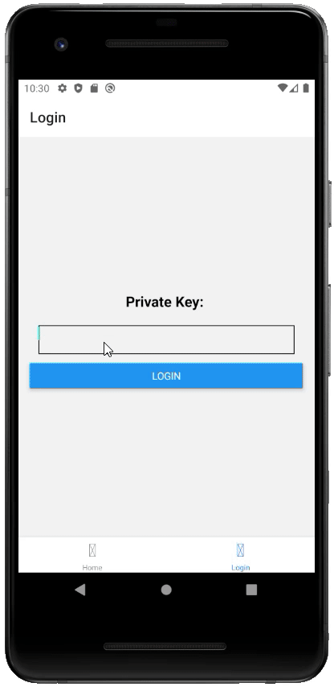

# klaytn-countbapp-expo

## 소개
클레이튼 예제 중에 CountBApp을 Expo CLI 개발환경에 구현한 프로젝트입니다.
> CountBApp Tutorial GitHub : https://github.com/klaytn/countbapp

## 개발환경
- Truffle
- Klaytn(caver-js)
- KAS(caver-js-ext-kas)
- React Native
- Expo CLI
- EAS

## 설치 및 시작
- Open terminal
- Clone the repo by running `git clone https://github.com/breaker8758/klaytn-countbapp-expo`
- Run `npm install`to install node packages
- Run `expo start`
- Developer tools running on http://localhost:19002
